# openbci-ceegrids
This repository contains the description and materials for the implementation of a cEEGrid adapter for the use with the OpenBCI Cyton + Daisy biosignal acquisition boards. 

## Version
The system is now available in its second version (V2). V2 includes various improvements to the design of enclosures and the PCB for easier use. Please refer to the Releases for the materials and documentation of V1.

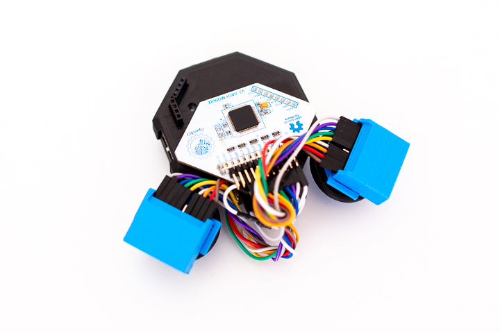 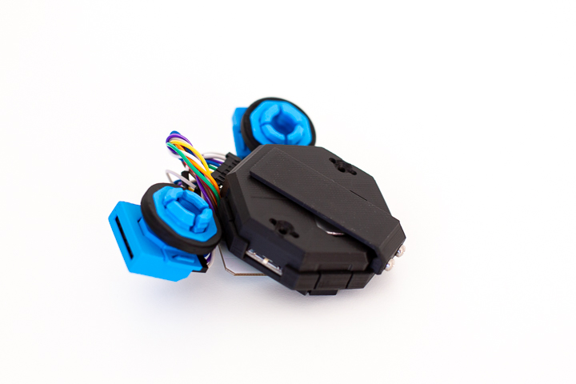 

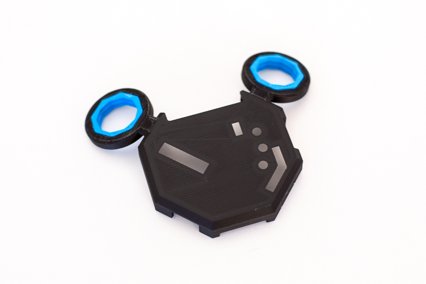 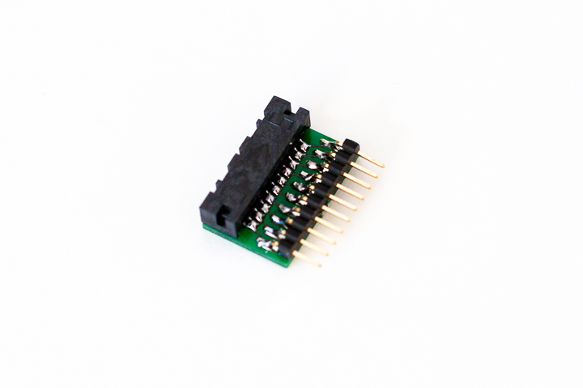

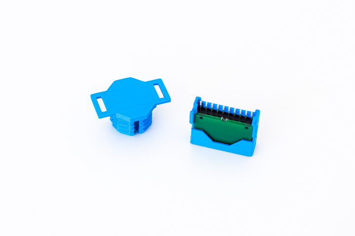 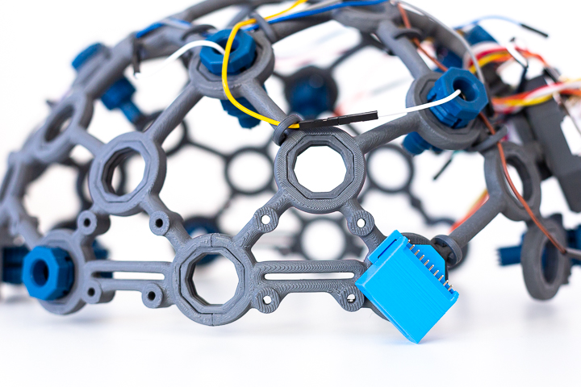

This repository contains:

1. [Bill of Materials (BOM)](#materials)
1. [3D-Print Files](./stl/)
1. [PCB File](./pcb/)
1. [Assembly Instructions](#assembly-instructions)
1. [Technical Evaluation Documentation](./lit/technical_evaluation.pdf)

Please take a look at the sections below and the other repository files for details.

------

## Application Options
Currently, there are two main options for using the system:

1. Isolated Use: 18-channel head-worn cEEGrid data collection (wear it using a headband, basecap, or even with a VR headset)
2. Combined Use: Selective cEEGrid channel use in combination with selected OpenBCI Ultracortex MK IV scalp electrodes (use it for the exploration of interesting channel and reference combinations). If you want to use this combination, it is sufficient to 3D-print the cEEGrid adapter enclosures (the adapted Cyton enclosure is not required). 

The applications shown below include images of V1 (white) and V2 (black/blue):

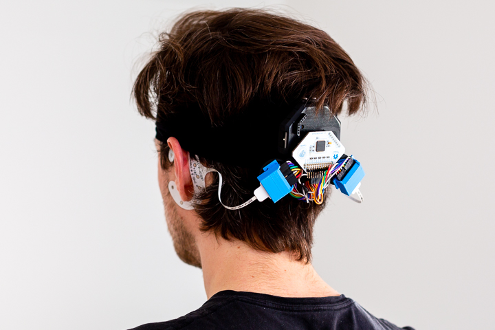 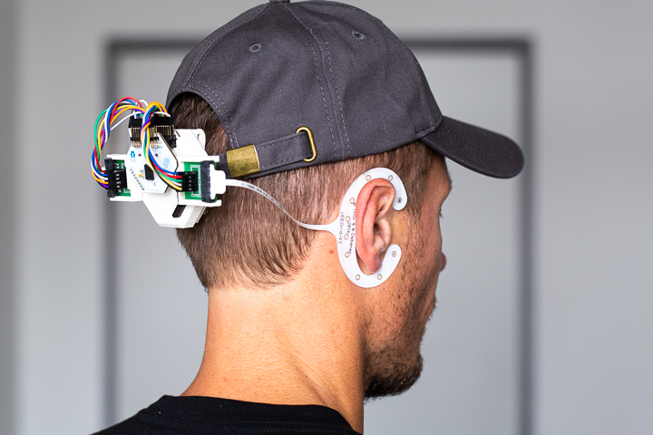

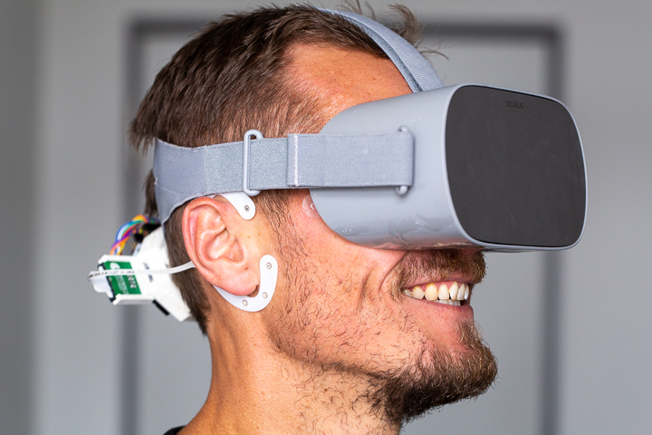 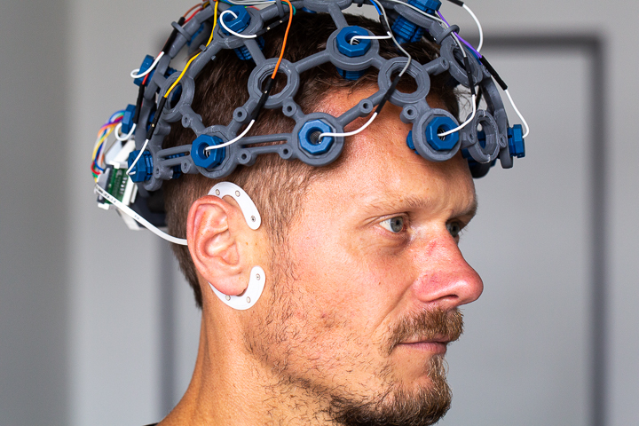

------

## Materials

| Amount | Part   Description                                                  | Instance /   Reference                                                                                               |
|--------|---------------------------------------------------------------------|----------------------------------------------------------------------------------------------------------------------|
| 1      | OpenBCI Cyton Board + Daisy Shield   (Biosignal Acquisition Boards) | Available from the manufacturer at: https://shop.openbci.com/collections/frontpage/products/cyton-daisy-biosensing-boards-16-channel?variant=38959256526                                                                                  |
| 2      | cEEGrid Electrodes                                                  | Available from   the manufacturer at: https://shop.tmsi.com/product/ceegrid                                          |
| 2      | Printed   Circuit Boards                                            | Custom [PCB File](./pcb/) available in this repository; Can be manufactured on demand, e.g. at   https://aisler.net/                                                                                                                                                                 |
| 1      | Re-designed Cyton + Daisy Board Mounts                              | Custom [3D-Print Files](./stl/) available in this repository;                   |
| 2      | PCB Holder                                                          | Custom [3D-Print Files](./stl/) available in this repository;                   |
| 1      | Headband Clip                                                       | Custom [3D-Print Files](./stl/) available in this repository;                   |
| 2      | No. 4 Screws for Brittle Plastic                                    | To attach the headband clip to the Cyton board mount - https://www.mcmaster.com/90385A323/                         |
| 2      | Mini Edge Card Socket                                               | SAMTEC MB1-120-01-L-S-01-SL-N –   configurable at https://www.samtec.com/products/mb1                                |
| 20     | Pin Headers                                                         | Here we used a 10-pin angled SMD header, with 2.54 inch pitch, e.g. available from Harwin Inc. (MPN: M20-8891045) |
| 20     | Jumper Cables                                                       | Here we used short (3 inch)   female/female jumper wires, e.g. available at   https://www.adafruit.com/product/1951  |

------

## Assembly Instructions
The herein described system is comprised of three main components: (1) The OpenBCI Cyton microcontroller with the Daisy shield that enables the low-cost mobile biosignal acquisition (e.g. EEG, ECG, or EMG), (2) the cEEGrid electrodes, a set of flexible printed Ag/AgCl electrodes in a c-shaped form that can be placed around a person’s ear using adhesives, and (3) the printed circuit board that transmits the signal from the applied cEEGrids to an amplifier. To assemble the system, please follow these instructions:

(1) For the OpenBCI Cyton+Daisy assembly for regular EEG data collection, please follow the thorough instructions provided by the device manufacturers: https://docs.openbci.com/docs/04AddOns/01- Headwear/MarkIV (Last accessed: September 13, 2020). In this documentation, the 3D printed parts are also provided (e.g. if you need to print the Ultracortex MK IV headset). As a power supply, use a ~500mAh lithium-ion rechargeable battery pack that fits into the board holder. To assemble the system, print the re-designed Cyton board mounts (bottom and top), the clip, and the hardware inserts (that allow the OpenBCI electrodes - or here: the cEEGrid adapter enclosure to be screwed in). Use two #4 screws for brittle plastic to attach the clip to the bottom board cover. Use super glue to join the hardware inserts and the top board cover. Regular FDM printing can be used with a standard 0.4 mm nozzle diameter and 0.2 mm layer height. Rather slow print speeds (e.g. 40 mm/s) should be used as the parts have fine details.

(2) To assemble the cEEGrid adapter, three parts are required, a contact point that connects to the cEEGrid pins (2mm pitch – used here is a mini edge card socket by the company SAMTEC), a simple printed circuit board, and a set of male or female pin headers with 2.54mm pitch (10 pins, single row). The parts can be joined using a soldering iron. To facilitate the soldering of the mini edge card socket to the PCB and to lower the risk of bridges it is recommended that every second pin (but starting with the first pin) of the card socket is removed before assembling the connector.

(3) Finally, to integrate the two initial components, a few additional steps and components need to be completed. For the herein shown system, a decision was made to solder on stack headers on to the PCB. Initially, individual jumper cables were soldered on to the PCB, yet were found to be a bit cumbersome to work with since not all of the cables can be used with the Cyton+Daisy boards (20 cables for 18 pins). Also, the stack headers provided more flexibility to adapt cable lengths for different mounting solutions. To link the cEEGrid PCB and the OpenBCI board, now only a set of 20 short female jumper cables is required. For this final assembly step, two important aspects need to be mentioned. First, the cables should be attached securely to reduce artefacts that might appear due to cable movement. We have opted for a simple solution of twisting the cables together to secure them. Second, care needs to be taken to route the cables to the recording pins on the OpenBCI board correctly. We recommend assembling all parts of the system and inserting the cEEGrids into the card sockets to facilitate the mapping process. We recommend connecting the left ear to the Cyton pins (channel 1-8 in the OpenBCI GUI) and the right ear to the Daisy pins (channel 9-16 in the OpenBCI GUI). We also recommend maintaining the colour coding to keep track of which electrodes are being used and which are left out (see a screenshot of the OpenBCI GUI below. For the correct routing of the reference and ground electrodes, please refer to the OpenBCI documentation mentioned in step (1). 

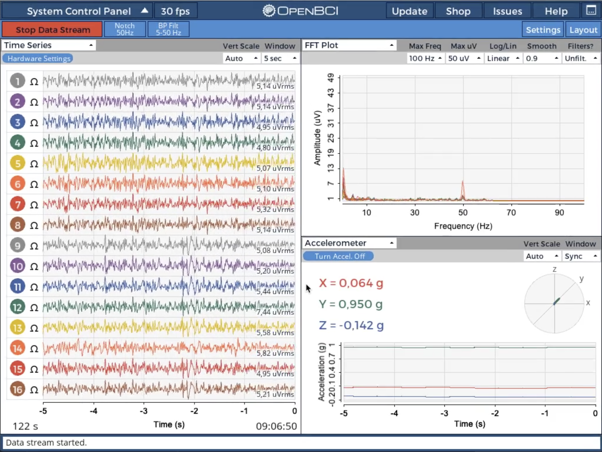